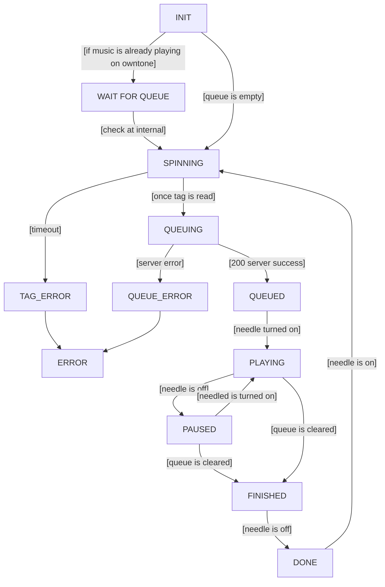

# State Machine

The main loop of the system is the state machine. 

- INIT = the first state that we start in
- WAITING_FOR_QUEUE = the queue is not empty, let the queue drain
- SPINNING = the record starts spinning to try and read it
- QUEUEING = we have read a tag but we are adding it to the queue
- QUEUED = server has queued the album
- PLAYING = server is playing
- PAUSED = server is paused
- FINISHED = server has emptied the queue